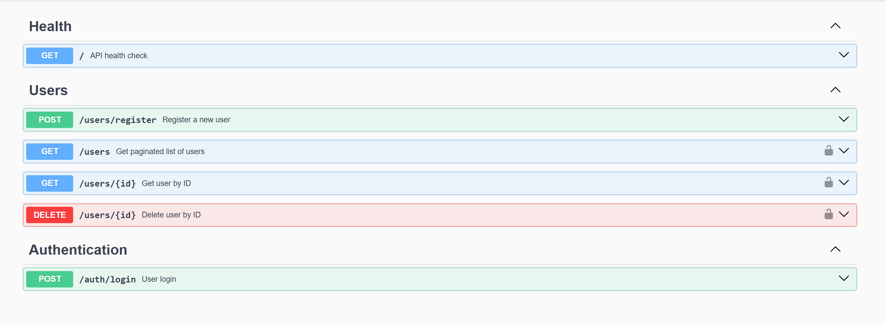

# BackEnd Boilerplate

A **Node.js + NestJS** back-end application with **Prisma** as ORM for PostgreSQL. Includes user management and basic authentication.



## Tech Stack

- **NestJS** - Progressive Node.js framework
- **Prisma** - Next-generation ORM
- **PostgreSQL** - Relational database
- **Winston** - Logging with daily rotation
- **bcryptjs** - Password hashing
- **TypeScript** - Type-safe JavaScript

## Running the project

To have this project up and running on your machine, check the **[Setup Guide](doc/setup.md)**, then access the API at `http://localhost:3000`

## Features

- ✅ TypeScript & NestJS modular architecture
- ✅ Prisma ORM with PostgreSQL
- ✅ JWT authentication with configurable expiration
- ✅ User management (create, retrieve, delete)
- ✅ Paginated user listing
- ✅ Password security (bcrypt + complexity validation)
- ✅ Centralized input validation utilities
- ✅ Environment variable validation with Zod
- ✅ Global exception filters
- ✅ Health check endpoint with database connectivity
- ✅ Unit testing with Jest
- ✅ Production-ready logging with Winston (daily rotation, multiple levels)
- ✅ Interactive API documentation with Swagger/OpenAPI
- ✅ Code quality with ESLint + Prettier + Git hooks

## Development

### Available Scripts

```bash
# Development
npm run dev          # Start development server with hot reload
npm run free         # Kill any process using port 3000
npm run clean        # Remove build artifacts and cache files (uses .gitignore as reference)

# Building
npm run build        # Compile TypeScript to JavaScript

# Code Quality
npm run lint         # Check code for linting errors
npm run lint:fix     # Auto-fix linting errors
npm run format       # Format code with Prettier
npm run format:check # Check code formatting

# Testing
npm test             # Run all unit tests
npm run test:watch   # Run tests in watch mode
npm run test:cov     # Run tests with coverage report

# Database
npm run prisma:generate # Generate Prisma Client
npm run prisma:migrate  # Run database migrations
```

## Documentation

- **[Setup & Getting Started](doc/setup.md)** - Installation and configuration guide
- **[Implemented Features](doc/implemented_features.md)** - Complete list of implemented features
- **[API Documentation](http://localhost:3000/swagger)** - Interactive Swagger UI (run `npm run dev` first)
- **[Testing](doc/testing.md)** - Unit testing guide and test coverage
- **[Logging](doc/logging.md)** - Winston logging system with daily rotation
- **[Security](doc/security.md)** - Authentication, password hashing, and security practices
- **[Validation](doc/validation.md)** - Input validation utilities and rules
- **[Code Quality](doc/code_quality.md)** - Best practices, naming conventions, linting, and git hooks
- **[System Modules](doc/modules.md)** - Application modules structure
- **[Extending the Project](doc/extending.md)** - Recommendations for adding features
